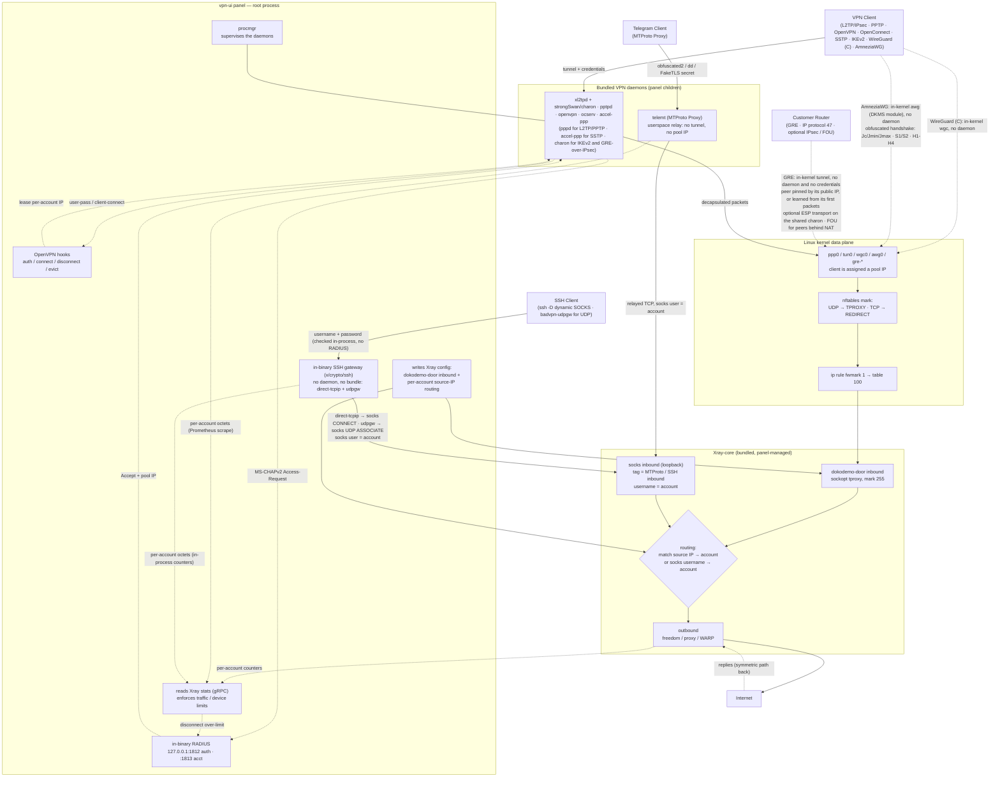
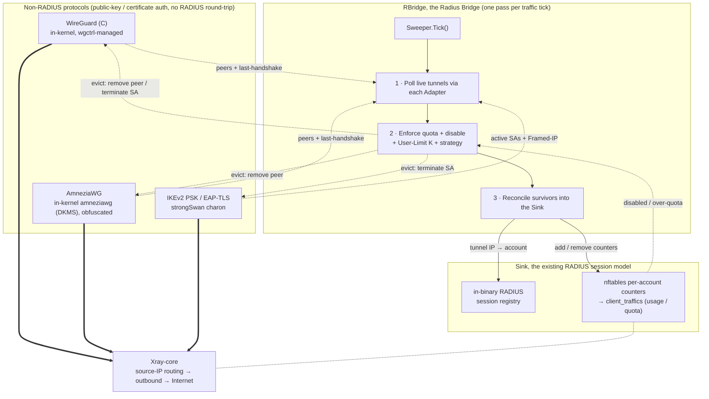

# Protocol architecture

## How the New Protocols Interact with Xray-core

## How RBridge Handles Non-RADIUS Protocols

WireGuard (C), AmneziaWG and the IKEv2 **PSK** / **EAP-TLS** modes authenticate with a public key or a certificate, so they never make a RADIUS round-trip. On their own they would get no session record, no traffic accounting, and no **User Limit** enforcement. **RBridge** (Radius Bridge) closes that gap: once per traffic tick its **Sweeper** polls each protocol's live tunnels, enforces quota, disable, and the per-account **User Limit** K (evicting the losers), then reconciles the survivors into the very same in-binary **RADIUS** session registry and **nftables** accounting the RADIUS protocols already use. A key-based protocol therefore behaves identically for usage, quota, and device limits, and egresses through the same Xray **dokodemo-door** data plane.

For the two key-based tunnel protocols, **WireGuard (C)** and **AmneziaWG**, a **User Limit** of K provisions K device slots per account: K keypairs, K configs and K distinct tunnel IPs, one config per device. That is the same model the commercial providers use, and it is what makes a single account usable on a phone, a laptop and a router at once without the devices fighting over one key.

